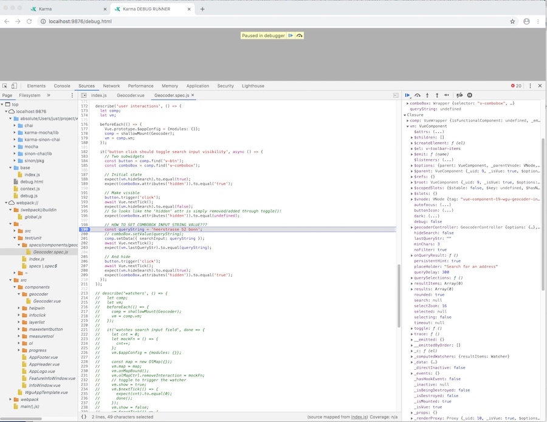

# Tips and Tricks for Testing

The default/standard command to run all tests:

``` bash
# run all tests
npm test
```

## Calling Karma Directly
`npm test` will eventually call `karma start test/unit/karma.conf.js --single-run`.

To have more control over options like debugging and single file, we can call Karma directly from the root of the project:

```bash
# Set env vars and alias/shortcut (Mac OSX example)
export CHROME_BIN=/Applications/network/Google\ Chrome.app/Contents/MacOS/Google\ Chrome
# or Chromium
export CHROME_BIN=/Applications/network/Chromium.app/Contents/MacOS/Chromium

alias karma=./node_modules/karma/bin/karma
karma start test/unit/karma.conf.js --single-run
```

## Test Single .spec file

To accelerate the code/debug cycle when e.g. working on a single component, one option is to
temporarily remove all `*.spec.js` files except the one you want to use/debug (see next).

In Wegue testing we added the custom option `--spec-file` (see [karma.conf.js](unit/karma.conf.js)
to to specify a single target `.spec.js` file. Example:

```bash
karma start test/unit/karma.conf.js --browsers=Chrome --no-single-run --spec-file ./specs/components/geocoder/Geocoder.spec.js
```

The spec-file location whould be relative to [karma.conf.js](unit/karma.conf.js).

## Stepwise Debugging

In some cases you may want to have a debugger, set breakpoints, step through your test- and
application code. This is possible in several ways. One is to use the browser.
Basics are is described [in this blog](https://glebbahmutov.com/blog/debugging-karma-unit-tests/), though quite
dated (2014), things are even easier today, even with `webpack`-processed files (via `sourcemaps`).

Run the test through `karma` directly:

```bash
karma start test/unit/karma.conf.js --browsers=Chrome --no-single-run
```

Here the Chromium (or Chrome) browser (`--browsers=Chrome`) overrules `ChromeHeadless` from Karma config and is launched staying active after
the test suite has been executed (`--no-single-run`). Then:

* go to the browser window
* click on "Debug" button
* open Chrome devtools via "Inspect" (Mac OSX keyboard: `Alt-Cmd-i`)
* Devtools: open the Sources tab
* Devtools Sources: open `webpack` folder and find both the test `*.spec.js`   files and application files (`*.vue`)
* Devtools Sources: set a breakpoint in a test or source file
* reload browser window, processing halts at breakpoint, see image below.



NB we may move the above `karma` commands as (`scripts`) to `package.json` later.
